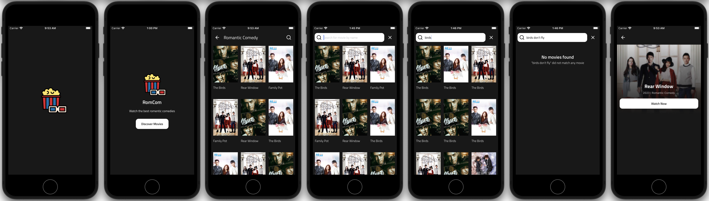

# The RomCom App



## What's in the stack

- Built with [React Native](https://reactnative.dev) using [Expo](https://docs.expo.dev)
- Static Types with [TypeScript](https://typescriptlang.org)

## Demo

Scan the QR code below to preview the app in [Expo Go](https://expo.dev/client)

### For Android devices


### For iOS devices


## Development

The following command will start Expo development server

```sh
$ npm start
```

Your file changes are watched, and assets are rebuilt upon change.

### Type Checking

This project uses TypeScript. It's recommended to get TypeScript set up for the editor to get a really great in-editor experience with type checking and auto-complete. To run type checking across the whole project, run `npm run typecheck`.
